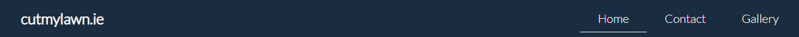
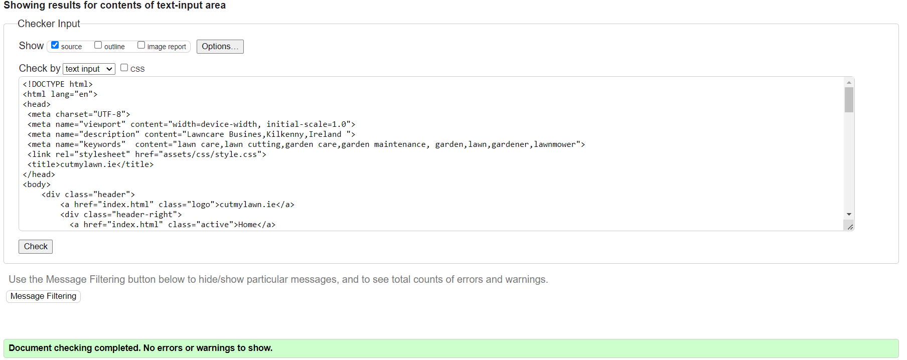
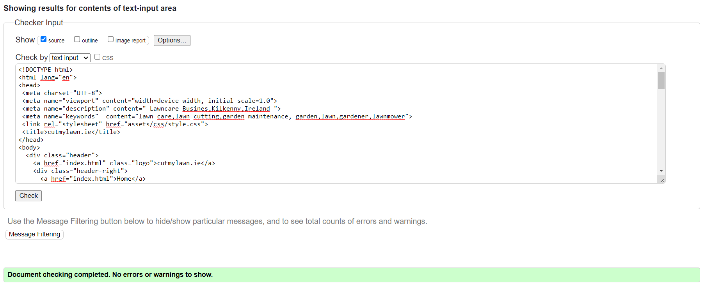
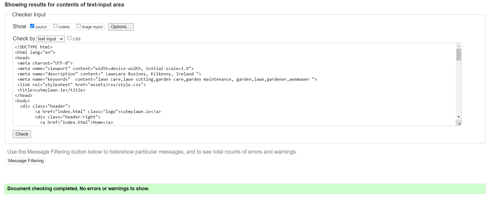
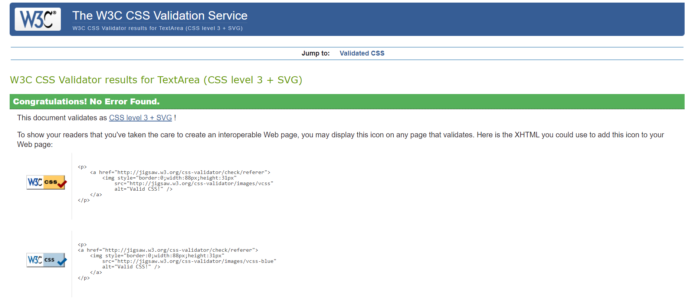

# cutmylawn.ie

Cutmylawn.ie is a website for users in the need for someone to cut their lawn. Users of the website will be able to find the information thay need about the service being provided, a showcase of work the  fictitious business has carried out to date and will also be able to enter their contact information to recieve a quote. The user also be able to interact with the website through google maps, detailing the location of the business and the also watch a youtube video providing information on a scarification service provided. 

--------
## User Stories

Client Goals

* To be able to view the site on a range of device sizes.
* To be able to explain what services are provided.
* To provide usefull information on lawn maintenance.
* To make it easy for  potential customers to be able to contact the owner/service provider.
* To provide an appealing showcase of previous work carried to first time and return visitors.
* To provide information on the location of the business to the user 

First Time Visitor Goals

* To be able to view the site on a range of device sizes.
* To be able to see what services are provided.
* To find usefull information on lawn maintenance.
* To be easily able to contact the owner/service provider.
* To find an appealing showcase of previous work carried out by the service provider. 
* To easily navigate the site. 

Returning visitor Goals 

* To be able to find updated gallery images of new work carried out.
* To be able to watch new videos on lawn maintenance. 
* To easily be able to get in further conatct with the client. 

Frequent Visitor Goals 

* To be able to find seasonal related information on lawn maintenance and work carried out by the client. 

-----

## Design 

Colour Scheme 

Due to the nature of the website green is a predominant color 
so I decided to use a pallet of colours which would complement green.
I used a brighter stand out color to draw attention to the contact button and white colored text where needed to make the text easier to read. I toned down the background color of the body from white to make the pages easier on the eye. I feel the color of the header and footer provide nice contrast to the rest of the color scheme. 

* #3A3A3A - Dark shade of gray
* #FFD200 - Light yellow shade
* #1A2D40 - Dark shade of cyan-blue
* #CCCCCC - Chinese silver/light shade of gray 
* #04AA6D - Green-cyan

---
## Typography

After trying different fonts I felt the the font which is is used in the love running project looked best on the website. I like these fonts the most as they look modern and are not too formal but still look professional. 

The google fonts used are: 

* Body font family: Lato, sans-serif
* h1 h2 font family: Oswald, sans-serif

---

## Imagery 

All imagery used are free to use images without copyright from a website called pixabay. 

---

## Media

I made sure to use a video where the user provided the embed code to be shared. The video is from youtube. 

'# Features

The website is comprised of 3 pages, all of which are accessible from the navigation menu: home page, contact page and gallery page.

## All pages on the website have:

1. A navigation menu on the top right hand side which allows the 
   user to navigate through the site. 
   The full responsive navigation bar includes links to the Home Page, Gallery Page and Contact Page allowing the user top navigate easily throughout the different pages and without the need for the back button.  
   The logo is on the top left hand corner and the logo when pressed provides a link to the Home Page. 
   
   Each link in the navigation bar remains underlined when the user is on that page making it easier for the user to track where they are on the website 

   The header is fixed so that it is always available as the user scrolls down through the page. 

  
   

2. A simple footer which just includes the important social links. I used the 
   same social links as the love running project for Facebook, Instagram , Twitter and youtube. I also added a logo and link to lnkedin. 

3. A main hero image with a stand out contact button which brings the user straight to the contact section of the website on the 
   contact page.The  hero image is is a picture of grass and blurred out to a degree  as to not to cause distraction and to ensure the contact button is the main focal. The hero image transform animation of a short 5s interval upon page opening/refreshing. 

## Home Page 

The home page has a hero image as described above and a middle section showcasing the business at work and short descriptions of what the business does along with descriptive images and video. On large screens there are two columns but on mobile decices these covert to a single column for ease of use. 

# Contact Page

 On the contact page a form is provided for the user to enter there name, email , the county in which they live in and additional details if necessary. The enables the user to communicate any queries to the client/business or to requesta quote based on the inforamtion given. name, email and county selection are a requirment to submit the form for which a submit button is provided. 
 Google maps is also provided on the contact page enabling the user to see the location of the business and source directions if needed. 

# Gallery Page 

 The Gallery page showcases the work carried out by the client for the user. There is three columns of pictures which reduce one single column for mobile device. 

 # Future Implementations 
 
 I hope to make use of javascript form the next module of my course to enhance the website. 

  ## Accessibility
  I have kept accessibilty in mind throughout the coding process to ensure the website is as accessible friendly as possible. I have achieved this by:

* Using descriptive alt attributes  on images on the site 
* Using semantic HTML
* Ensuring that there is a sufficient colour contrast throughout the site. 
* Ensuring there is sufficient color contrast throughout the site. 

# Languages Used

* HTML and CSS were used to create this website.
* Git -For version control. 
* Github -To save and store the files for the website. 
* Font Awesome - For the social icons on the footer. 
* compressjpeg.com - To compress the images. 
* Am I Responsive? (website) : To check the website on a range of devices.

---

 # Deployment 

 I used github pages to deploy the website, I did this by carrying out the steps below:

1. I signed up and logged in  to Github.
2. I found the repository for this project, ryan7984/portfolio1 and clicked on it.
3. I then clicked on the Settings link.
4. I clicked on the pages link in the left hand side navigation bar.
5. In the Source section, I chose main from the drop down menu and then I selected root from the 
   drop down select folder menu.
6. I then clicked Save and after some time and a page refresh a message   came up "Your live Github 
   Pages site is now deployed at the URL shown" and a link was then available for me to click and view my website. 

# Testing 

   Testing was ongoing throughout the whole process. I used Chrome developer tools, W3C HTML Validator and W3C CSS Validator (jigsaw)

* Chrome Developer

* Home Page HTML- No Errors found

---

* Contact Page HTML - No Errors found 

---
* Gallery Page HTML - No Errors found 

---

* CSS  - No Errors found 
  

#  Unfixed Bugs 

 * No unfixed bugs found.

 ---

 # Credits 

 * The code to make the social media links in the footer was taken from the Love Running project and I added the Linkedin link and logo.
 * After testing different fonts and font colours I found I liked the font from the Love Running project the most and I found it just seemed best suited to my colour scheme.  
 * I saw people talking about flexbox on slack and I tried this out on the gallery page, I found youtube tutorials helpfull for this particularly those by the user "Tech2 etc". 
 * For the contact form I used what I learned from this course and research on the w3 schools website. 
 * All images are free images from the website www.pixabay.com 
 * The youtube video used on the home page is  from JayRock Lawn Care & Gardening
   @JayRockLawnCareGardening, for which the embed code was free to share. 

--

   

